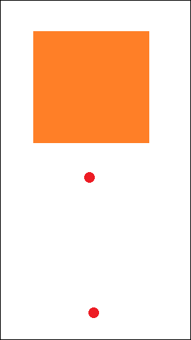

# Simba

Simba is a fast and deterministic all-Python Lennard-Jones particle simulator that utilizes Numba for GPU-accelerated computation (hence the name, **Sim**ulation with Num**ba**).

## Installation
Simba uses following libraries:

* Numpy
* Numba
* Pillow
* PyGame
* Cuda-Python

To install Simba, use the following command from the Simba directory:

```shell
pip install .
```

Please note that the installed package name will be 'simba_ps' to avoid conflicts with other Simbas in the pip repositories.

Before installing Simba, make sure to install the CUDA Toolkit, as it is required for Numba. You can find the software requirements and installation instructions in the [Numba documentation](https://numba.readthedocs.io/en/stable/cuda/overview.html#software).

Simba was developed and tested on Numba version 0.55.1, which requires CUDA Toolkit 11.x to function. It has been tested with CUDA Toolkit versions 11.2 and 11.4. You can download the CUDA Toolkit installer directly from the [NVidia archive](https://developer.nvidia.com/cuda-11-4-4-download-archive).

For installation instructions, please refer to the following links:
- [CUDA Installation Guide for Microsoft Windows](https://docs.nvidia.com/cuda/cuda-installation-guide-microsoft-windows/index.html) 
- [CUDA Installation Guide for Linux](https://docs.nvidia.com/cuda/cuda-installation-guide-linux/index.html) 

If you prefer not to install the CUDA Toolkit system-wide, you can use the NVidia installation instructions to install it via Conda.

Ensure that the CUDA toolkit binaries are available in the PATH environment variable before running simulations.

## Usage

Simba is easy to set up. To simulate an impact like the one shown in the gif below to the right, you'll need an image in *.bmp format to set the initial positions (left). Alternatively, you can generate particle placement in code.

 

Few lines of code are needed to run this simulation:

```python
# imports omitted for brevity

def main():
    # load image with initial particle positions
    img = Image.open("simba_examples/inputs/impact_480_270.bmp")

    # create Simba instance with unmoving particles in the place of the black pixels,
    # with heavier particles in the place of the red pixels with a potential well depth of 5.0,
    # and with a bulk of slow (cold) particles in the place of the orange pixels with a potential well depth of 10.0

    sim = Simba.from_image(img, {
        (0, 0, 0): {'m': 0.0},
        (237, 28, 36): {'v': 0.5, 'eps': 5.0, 'm': 2.0},
        (255, 127, 39): {'v': 0.01, 'eps': 10.0, 'm': 1.0},
    })

    # set velocity of 'projectile' particles pointing straight up
    set_vector_by_p_type(1, cuda.to_device(np.array([0.0, -30.0])), sim.particle_count, sim.p_types, sim.velocities)

    # set rendering options to render a smooth-scaled simulation
    scale = 2
    camera = Camera(sim, sim.width * scale, sim.height * scale)
    camera.scale = scale
    camera.view_point = cuda.to_device(np.array([sim.width * 0.5, sim.height * 0.5]))
    camera.colors_from_types({0: (1.0, 1.0, 1.0)})

    render_option = {'render_mode': 'smooth', 'falloff_radius': 5, 'value_max': 7}

    # start simulation and rendering
    PyGameSimApp().run(sim, camera, seconds=60*5, substeps=15, render_options=render_option)
```

The simulator comes with several examples that can be called as command line executables, or via Python. Each example has several command-line parameters, which can be listed using the `--help` argument. You can find a slightly more complicated version of this impact simulation in the examples section below.

## Examples

1. **simba-impact**

   This command runs `simba_examples/impact.py`. It simulates the impact of a small projectile made of one type of particle on a large bulk of particles of another kind. You can set the masses of both types of particles, as well as the binding energy value for them.

   You can choose to render particles as smoothed colored gradients derived from particle density (left gif) or as separate particles with color representing their velocity magnitude (right gif) by setting `--render_mode` to `'smooth'` or `'velocity'`. This option is available in all examples.
  
     


2. **simba-hexcells**

   This command runs `simba_examples/hexcells.py`. It simulates particles confined to 10 separate containers with increasing initial particle kinetic energy (temperature). You can set the binding energy value via command-line arguments.

   


3. **simba-distillation**

   This command runs `simba_examples/distillation.py`. It simulates a distillation process where a mixture of two types of liquid, blue and red, is heated in a simulated alembic, evaporated, and condensed in separate flask.

   You can choose either the large variant of the simulation (43k particles) or the small one (13k particles), as well as set the maximum heater temperature.
   
    


4. **simba-vortex**

   This command runs `simba_examples/vortex.py`. It simulates a large number of particles confined in a square box with a force acting up on the left side of the box and down on the right side, causing the particles to form a swirling vortex.

   You can change the particle density and binding energy via command-line arguments.

   

5. **simba-deterministic-fall**

   This command runs `simba_examples/deterministic_fall.py`. Simba is deterministic, which means you can run a simulation, use the final positions of particles to assign colors to them, run the simulation again, and observe the particles forming a coherent picture.

   This example demonstrates this effect. You need to run it twice to see the result. On the first run, the script checks if there is a saved final simulation state in the output directory. If not, it starts the first pass. You can also force the script to compute the first pass with the parameter `--first_pass=True`. For 100 seconds, particles drip into two jars, making the initial pictures indiscernible. At the last tick, the same pictures will be assigned to the particles in the jars, and this color mapping will be saved in the output folder along with the initial state.

   On the second run, the script looks for this color mapping, and if it is present, it starts the simulation from the beginning. So at the 100s mark, all particles will form these images in the jars. The gif on the left shows the first pass, and the gif on the right shows the second pass.

    


6. **simba-chemistry-101**

   This command runs `simba_examples/chemistry_101.py`. It provides an example of virtual chemistry with 3 types of particles. The Lennard-Jones potential has 2 parameters: the depth of the potential well, defining the binding energy between two particles, and the bond radius, defining the optimal distance between particles from an energy perspective. You can set these parameters for each pair of particle types (red, blue, and orange) via command line.
   
   


7. **simba-chemistry-201**

   This command runs `simba_examples/chemistry_201.py`. It is a more complex example of virtual chemistry. The simulation includes 2 types of molecules in a jar: 4 red particles + 1 blue and 4 green + 1 yellow. Initially, they are relatively stable and do not interact much with each other, as the blue particles are shielded from the yellow ones by the relatively inert red and green particles. However, the energy of the yellow-blue bond is orders of magnitude higher than all other variants. This energy is released in the form of kinetics upon the formation of the yellow-blue particle and is enough to tear apart other stable molecules, exposing new particles to the reaction. The reaction needs just a little kick to become self-sustainable and display the domino effect. There is also a thermostat that activates when the temperature reaches 450 degrees, cooling all particles down and allowing "polymer chains" to form.

   

   


You can check out prerendered videos of experiments with Simba on my [Youtube channel](https://www.youtube.com/channel/UCBH_7JOXlyvVJO_bkj-vXNA) 